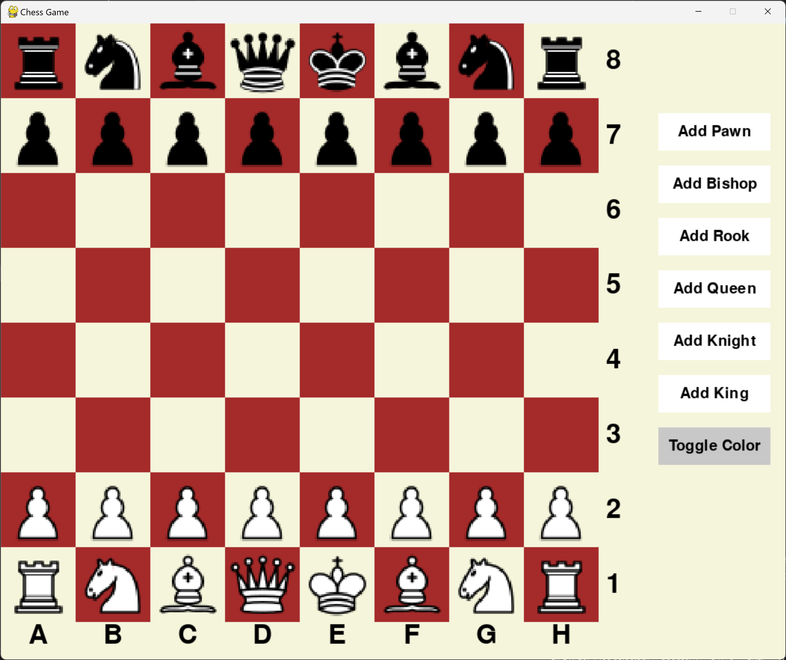
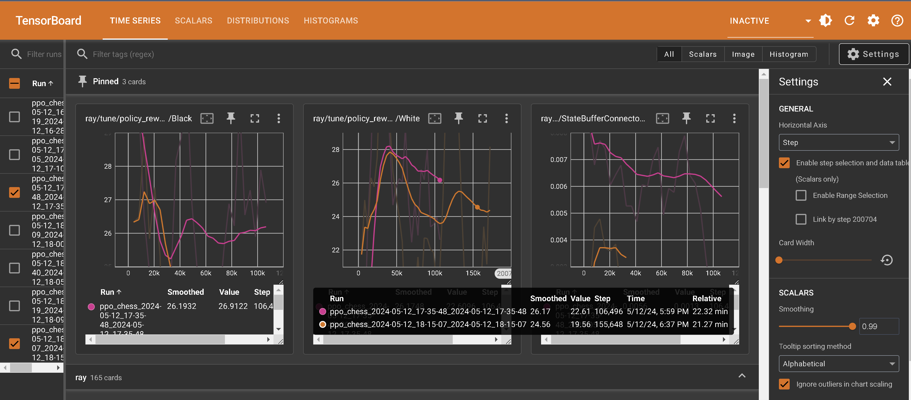

# Chess Project

Welcome to the Chess Project! This Python project encompasses various components aimed at exploring and enhancing the game of chess. Here's an overview of what you'll find:

## Chess Board Base Class: 
A foundational class that implements the rules of chess, providing the groundwork for the game's mechanics.

## Interactive Gameplay Script: 
Experience chess like never before with our interactive gameplay script. Play against a friend in a visually engaging environment powered by pygame. Simply drag and drop pieces to make your moves!
<center>

</center>


## Reinforcement Learning Environments: 
Dive into the world of AI with our reinforcement learning environments, designed to work seamlessly with OpenAI Gym. We offer two environments: one where a single agent learns by playing against itself, and another where two agents engage in a strategic battle.

## Reinforcement Learning Agent Training: 
Train your own AI agent using the powerful Proximal Policy Optimization (PPO) algorithm from ray.rllib. Watch as your agent learns and evolves to master the game of chess.
<center>

</center>

## Minimax Algorithm Implementation: 
Explore advanced gameplay strategies with our implementation of the minimax algorithm enhanced with alpha-beta pruning. Witness the AI make calculated moves to outmaneuver opponents on the chessboard.

# Installation
To get started, clone the repository and install the required dependencies using the following commands:

```bash
git clone
cd chess
pip install -r requirements.txt
```

# Usage
To run the interactive gameplay script, execute the following command:

```bash
python play.py
```

To train a reinforcement learning agent, run the following command:

```bash
python train.py
```

## Setting Configurations
You can modify the configurations for the gameplay script and reinforcement learning agent by editing the `config.yaml` file. Here, you can adjust parameters such as the board size, number of agents, and training iterations...

# How to Contribute
We welcome contributions from the community! If you're interested in enhancing the project, please follow these steps:

1. Fork the repository
2. Create a new branch (`git checkout -b feature`)
3. Make your changes
4. Commit your changes (`git commit -am 'Add feature'`)
5. Push to the branch (`git push origin feature`)
6. Create a new Pull Request

# License
This project is licensed under the MIT License - see the [LICENSE](LICENSE) file for details.