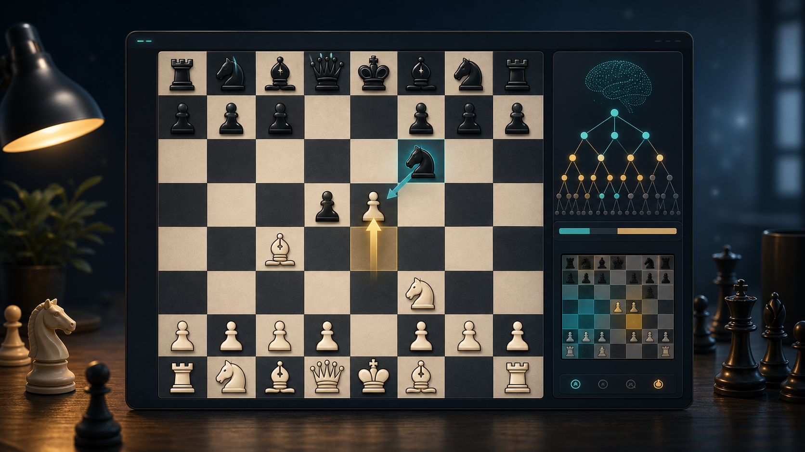
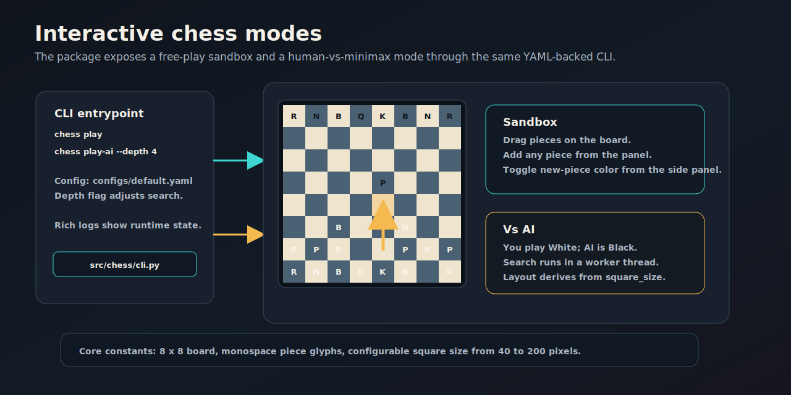
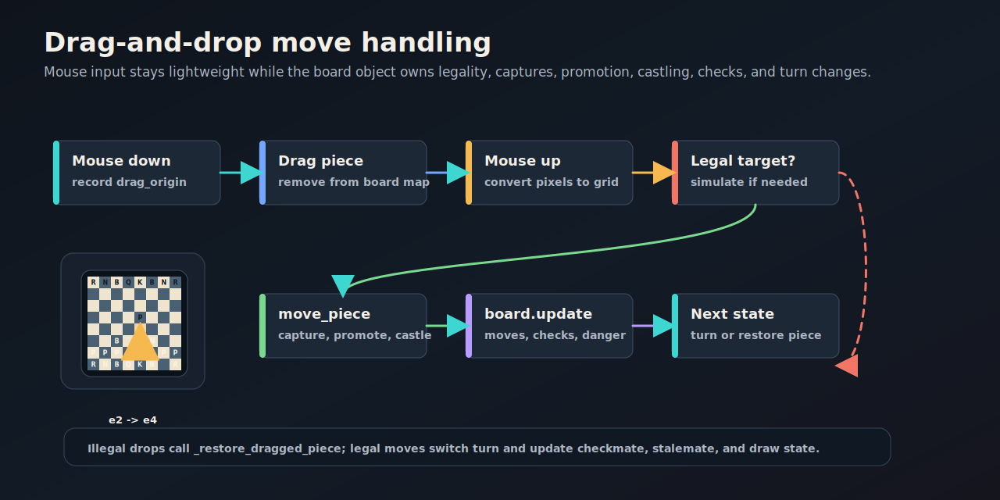
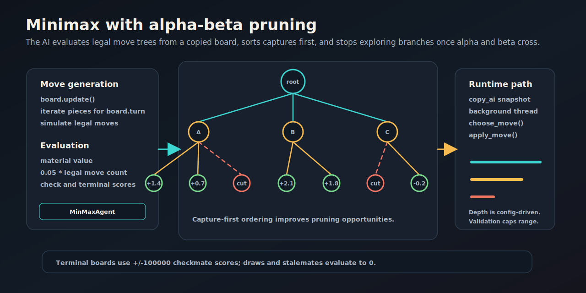

# Chess

<p align="center">
  <a href="https://github.com/alhussein-jamil/Chess/actions/workflows/ci.yml"></a>
  <a href="https://www.python.org/downloads/"></a>
  <a href="https://www.pygame.org/"></a>
  <a href="https://docs.astral.sh/ruff/"></a>
</p>

<p align="center">
  
</p>

Pygame chess board with drag-and-drop play, a free-piece sandbox, and a minimax opponent with alpha-beta pruning.

## Project Status

| Area | Status |
|------|--------|
| Interface | Package CLI, Pygame board rendering, drag-and-drop input, coordinate labels, sandbox piece creation panel, and vs-AI status panel are in place. |
| Rules | Legal move generation, captures, promotion, castling, check, checkmate, stalemate, draw by material, and move-without-capture draw tracking are implemented in the board layer. |
| AI | `MinMaxAgent` searches copied board states with minimax, alpha-beta pruning, capture-first ordering, material/mobility evaluation, terminal mate scores, and optional move subsampling. |
| Tests | Smoke, board movement, layout, and minimax behavior tests are configured for headless CI with SDL's dummy video driver. |

## What This Implements

- Interactive chess board using committed piece PNG assets and a dark themed UI.
- Free-play sandbox for dragging existing pieces and adding new pieces from the side panel.
- Human-vs-AI mode where the player is White and the black side searches in a background thread.
- YAML-backed runtime settings for display size, AI depth/color, move subsampling, and promotion choice.
- Configurable CLI through `chess play` and `chess play-ai`.
- Pytest, Ruff, pre-commit, and GitHub Actions CI.

## README Figures

The interface figure shows how the CLI, YAML config, sandbox, and vs-AI mode fit together.



The move-flow figure mirrors the drag-and-drop path in [src/chess/core/board.py](src/chess/core/board.py), from mouse input through legal move validation and board updates.



The AI figure summarizes the minimax search path in [src/chess/ai/minmax.py](src/chess/ai/minmax.py).



Regenerate the deterministic SVG README figures with:

```bash
python3 scripts/generate_readme_assets.py
```

The opening banner was generated as a stylized visual asset for this README and saved at `docs/assets/chess-minimax-hero.png`.

## Install

```bash
cd ~/Projects/Chess
uv venv
uv pip install -e ".[dev]"
```

## Run

Smoke check (no window):

```bash
uv run pytest tests/test_smoke.py -v
```

**Sandbox** — drag pieces, add new ones from the side panel:

```bash
uv run chess play
```

**Vs AI** — you play White:

```bash
uv run chess play-ai
# override search depth
uv run chess play-ai --depth 4
```

## Tests

```bash
uv run pytest -v
uv run pre-commit run --all-files
```

## Config

Default file: `configs/default.yaml`. Override with `--config`. CLI flags override YAML only when noted.

| Key | Default | Notes |
|-----|---------|-------|
| `display.square_size` | `100` | Pixel size of each square (40–200) |
| `display.sandbox_width` | `1050` | Sandbox window width |
| `display.sandbox_height` | `860` | Sandbox window height |
| `display.vs_ai_width` | *(auto)* | Ignored — window size derived from `square_size` |
| `display.vs_ai_height` | *(auto)* | Ignored — window size derived from `square_size` |
| `ai.depth` | `3` | Minimax depth (1–8); `--depth` on `play-ai` overrides |
| `ai.workers` | `0` | CPU workers for search (`0` = all cores, `1` = single-threaded) |
| `ai.color` | `black` | AI side (`white` or `black`) |
| `ai.max_n_samples` | `null` | Random move subsample cap for search |
| `game.promotion` | `queen` | Pawn promotion piece |

CI uses `configs/smoke.yaml` (depth 1, smaller display).

## Paths

| Path | Contents |
|------|----------|
| `assets/` | Committed piece PNGs |
| `src/chess/ui/colors.py` | Shared board and panel colors used by the app and README figures |
| `artifacts/` | Run outputs (gitignored) |
| `configs/` | YAML settings |
| `docs/assets/` | Generated README banner and deterministic SVG figures |
| `scripts/generate_readme_assets.py` | Rebuilds the README SVG figures |
